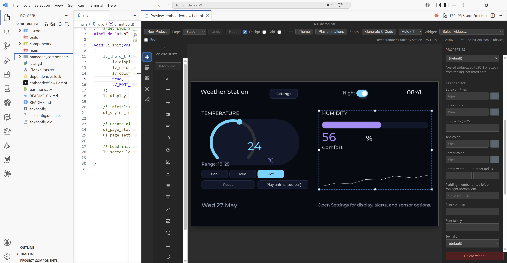

# embeddedflow — LVGL UI design in VS Code

Design touch UIs for embedded devices without leaving your editor. **embeddedflow** lets you lay out screens in a visual preview, wire navigation and interactions, and export ready-to-build **C** code for **LVGL**.

  

<em>Live LVGL preview inside VS Code — design mode, widget tree, properties, and a multi-page station sample.</em>

---

## What's new in v1.2.0-beta.1

**Pre-release** — install **Switch to Pre-Release Version** on the Marketplace, or use the latest `.vsix`.

- **Navigation flow diagram** — open **Navigation flow** in the workspace: page boxes, connection lines, drag to arrange, click a page for its transition list, **+ Add connection** to wire two pages.
- **Bidirectional links** — mutual navigation between two pages renders as a single double-headed connector.
- **Workspace tabs** — closable tabs per page plus a dedicated flow tab; stay on the flow diagram while adding multiple transitions.
- **Toolbar** — Project / Edit / View dropdown menus; preview auto-fit and loading improvements.

## What's new in v1.1.x

**v1.1.x** improves preview fit-to-window zoom, settings/navigation in the station sample, reliable `LV_SCR_LOAD_ANIM_*` codegen, and VSIX packaging so **EmbeddedFlow: Open Preview** registers correctly.

## What's new in v1.0.0

**v1.0.0** is the first feature-complete release for day-to-day LVGL UI design in VS Code: edit named styles, data fields, bindings, and animations in the Properties panel, generate matching C, and use the new **knob** widget.

- **Knob widget** — rotary control in the palette; codegen emits a styled `lv_arc` with sensible defaults.
- **Data model & bindings** — declare fields once; bind labels with `{{field_id}}` and numeric widgets (slider, bar, arc, knob) with **Value bound to**. Generated `ui_bindings_apply()` keeps UI in sync.
- **Named styles & animations** — reusable `project.styles[]`, per-widget `styleRefs`, and `animations[]` with full inspector editors and `ui_styles.c` / `lv_anim_t` codegen.
- **Fonts** — **Add Font to Project**; optional TTF/OTF → `.c` via `lv_font_conv` when installed.
- **Sidebar** — **Tree** (widget hierarchy with drag-reparent) and **Settings** (project, display, codegen) panels work from the left rail.
- **Theme** — toolbar light/dark toggle writes `project.theme.dark` to your `.embf` so the preview stays consistent while you edit widgets.

Earlier highlights (still included): grouped widgets, canvas rulers & pan, page flows, `ui_fonts` codegen, image assets, undo/redo, and live WASM preview for LVGL 8/9.

If you installed an older Marketplace build and see **"command not found"**, install **v0.3.3** or newer and reload the window.

---

## Why embeddedflow?

Building LVGL interfaces by hand means juggling object trees, styles, screen loads, and event callbacks in C. embeddedflow keeps your UI in a single **`.embf` project file**: edit visually or in JSON, see the result in a **live LVGL preview**, then generate firmware sources that match your display and LVGL version.

**You get:**

- Faster iteration — change layout, save, preview updates
- Fewer wiring mistakes — navigation and flows are defined declaratively
- One source of truth — the same project drives preview and generated C

No separate designer app. No cloud account. Everything runs inside VS Code or Cursor.

---

## Features (detailed)

### Project format (`.embf`)

- JSON project file with schema validation and editor autocomplete
- **Project metadata** — name, LVGL version (`8.4.0` or `9.x`), optional output path
- **Display** — width, height, orientation, bit depth, color format, optional **round** display clip in preview
- **Theme** — light/dark colors used by preview and codegen
- **Pages** — multiple screens, each with its own widget tree
- **Images** — register PNG/JPEG/BMP assets by id; reference from `image` widgets
- **Component library** — save reusable groups; insert them from the palette

### Visual design & live preview

Open **embeddedflow: Open UI Preview** on any `.embf` file. The preview runs LVGL in a **WebAssembly** panel so widgets, styles, and page transitions behave close to on-device behavior.

| Mode | Purpose |
|------|---------|
| **Design** | Place, select, drag, resize, and edit widgets; overlay shows selection and snap guides |
| **Run** | Interact with the UI (buttons, sliders, etc.) and test navigation / swipes like an end user |

**Preview toolbar**

- **Workspace tabs** — closable tabs for each page preview and **Navigation flow**
- Page selector and page list sidebar (add, rename, remove pages)
- **Design** toggle
- **Zoom** — auto-fit or fixed scale (10%–400%)
- **Widget** dropdown — quick selection of widgets on the active page
- **Undo / Redo** — design edits with history preserved across reloads when supported by the host
- **New Project** — create a starter `.embf` without leaving the preview

**Canvas interaction (design mode)**

- Click to select; **Shift** add to selection; **Ctrl/Cmd** toggle selection
- Rubber-band **marquee** on empty canvas (with same modifiers)
- **Drag** to move selection; **magnetic snap** to edges and centers of other widgets
- **Multi-select** inspector — align, distribute, match size, combine into group
- **Delete** / **Backspace** removes selected widget(s)
- **Escape** clears selection; in group-edit mode, exits back to the whole group

**Widget palette**

Add widgets from the sidebar: label, button, slider, switch, bar, arc, **knob**, checkbox, dropdown, roller, textarea, line, image, container, panel, spinner.

**Property inspector**

- Position, size, hidden flag
- Type-specific fields (text, ranges, options, etc.)
- **Appearances** — styles/events where applicable
- **Images** — asset id combobox, browse to register files into `project.images[]`
- **Page inspector** — page name, display, theme, codegen path; **named styles** and **data fields** lists
- **Widget inspector** — `styleRefs`, numeric **bindings**, and **animations** where applicable

**Groups (container / panel)**

- **Combine into group** — merge multi-selected siblings into one container
- **Ungroup** — lift children to the parent level
- **Save to library** — reuse the group on other pages/projects
- **United selection** — one click selects the whole group
- **Edit contents** — edit children independently (double-click or inspector); orange outline shows group bounds while editing

### Flows & navigation

Define behavior declaratively in the project JSON and edit from the **Navigation flow** workspace tab (or the **Flow** icon in the left rail):

- **Flow diagram** — pages as draggable nodes; connection lines show widget clicks and swipe transitions; bidirectional pairs use one double-headed connector
- **Page inspector (flow)** — select a node to list, add, edit, or remove transitions for that page
- **Widget events** — e.g. button click → navigate to another page, set theme, or other actions
- **Page navigation** — target page, animation (slide, fade, etc.), duration
- **Swipe gestures** — swipe left/right/top/bottom to open a page with the same transition options
- **Preview** — run mode follows navigation stack; back navigation where configured

Generated C includes navigation and event wiring aligned with your flows (LVGL 8 and 9).

### C code generation

**embeddedflow: Generate C Code** writes firmware-oriented sources (default `ui_output` next to the `.embf`, or `project.outputPath` / workspace setting):

- `ui.c` / `ui.h` — application entry
- Per-page screen sources
- Event handlers and navigation stubs matching flows
- Respects **LVGL version** and include path from the project

**Optional:** `embeddedflow.liveGenerateOnSave` regenerates on save (skips when parse/semantic errors exist).

Configure in `.embf`:

- `project.lvglVersion` — `8.4.0`, `9.2.2`, `9.3.0`, `9.4.0`, `9.5.0`
- `project.lvglInclude` — e.g. `lvgl.h` vs `lvgl/lvgl.h` for ESP-IDF

### Editor integration

- **Language** — `.embf` with JSON schema validation (`embf.schema.json`)
- **Commands** on editor title bar when a `.embf` file is active
- **Explorer** — New Project, Open Preview, Generate Code on folders/files
- **Sample** — `sample/demo.embf` included in the extension package
- **Output log** — **embeddedflow: Show Output Log** for codegen and diagnostics

### Workspace settings

| Setting | Description |
|---------|-------------|
| `embeddedflow.defaultLvglVersion` | LVGL version for **New Project** wizard |
| `embeddedflow.autoOpenPreview` | Open/refresh preview when opening `.embf` or on startup if a root `.embf` exists |
| `embeddedflow.outputDirectory` | Default codegen folder when not set in the project |
| `embeddedflow.liveGenerateOnSave` | Regenerate C on save |

---

## Commands

| Command | What it does |
|---------|----------------|
| **embeddedflow: Open UI Preview** | Live LVGL canvas for the current `.embf` |
| **embeddedflow: New Project** | Wizard: folder, name, LVGL version → new `.embf` |
| **embeddedflow: Generate C Code** | Export C sources |
| **embeddedflow: Add Font to Project** | Register a font; optional `lv_font_conv` conversion |
| **embeddedflow: Show Output Log** | Extension log |

---

## Getting started

1. Install from the Marketplace or install the latest `.vsix` and reload.
2. Run **embeddedflow: New Project** or open `sample/demo.embf`.
3. Click **Open UI Preview** (editor toolbar or Command Palette).
4. Enable **Design** to add and arrange widgets; disable it to test interactions.
5. Run **embeddedflow: Generate C Code** and copy output into your firmware tree.

---

## Who is this for?

- Firmware developers using **LVGL** on microcontrollers
- Teams who want a **repeatable UI workflow** in the same repo as application code
- Anyone prototyping **embedded touch UIs** before committing to full C layout code

---

## Requirements

- **VS Code 1.85+** or Cursor
- For firmware: your LVGL / ESP-IDF / SDK project to compile generated C

---

## Feedback & source

- **Issues & feature requests:** [GitHub Issues](https://github.com/alitaroosheh/EmbeddedFlow/issues)
- **Repository:** [github.com/alitaroosheh/EmbeddedFlow](https://github.com/alitaroosheh/EmbeddedFlow)

## License

**GPL-3.0-or-later** — see [LICENSE](./LICENSE). You may use, modify, and distribute this extension under the terms of the GNU General Public License v3 (or any later version). LVGL remains under its own license where bundled for the preview runtime.
